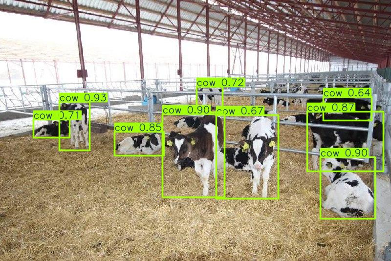

# Телеграм бот для детектирования коров по фото

reference: <https://www.kaggle.com/code/stpeteishii/cows-yolov8-train-and-predict/notebook>

Этапы выполнения:  

1) Ознакомление с вариантом (можно взять свой по согласованию с руководителем практики).

2) Подбор архитектуры нейронной сети.

3) Реализация веб-интерфейса. Создать простое веб-приложение. Реализовать: Загрузку изображений/видео/стрим с открытой камеры, кнопку запуска обработки, вывод результатов.

4) Интеграция предобученной модели.  

5) Вывод статистики в веб-интерфейсе. Реализовать сохранение истории запросов (в JSON или БД), генерацию отчёта (PDF/Excel).

